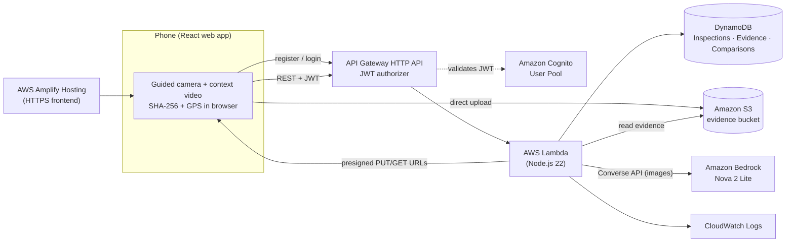

# AssetTrace

**"It was already like that." Not anymore. AssetTrace locks in the condition of anything you hand over, then shows you exactly what changed when it comes back.**

Built by **Team Pandoras Box** for **First Commit** (WeMakeDevs × AWS, Bharat Builds Tour, Event 01) · Ship It track

| | |
|---|---|
| **Live demo** | https://assettrace.d2re85crrtyc3z.amplifyapp.com *(open on a phone; camera, video and GPS need HTTPS)* |
| **Demo video (3 min)** | https://youtu.be/_fV54OxvKOc |
| **Repository** | https://github.com/utk1college/AssetTrace |

**Capture → Verify → Acknowledge → Lock → Return → Compare → Report**

---

## The problem

Every rental handover ends the same way: *"it was already like that."*

A tenant hands back a flat, a friend returns a borrowed scooter, a landlord repaints a wall. Nobody has proof of what the condition was at the start. Photos live on one person's phone, can be edited or lost, and the other party never agreed to them. Deposits get withheld and relationships sour over damage that no one can prove either way.

## Who it is for

Two people on either side of a handover, the **Owner** and the **Renter**, who both need to trust the same record. AssetTrace supports scooters, bikes, apartments, houses and walls/surfaces.

## What it does

1. **The Owner captures the baseline.** A guided in-app camera flow walks through named capture points (front, left side, kitchen, and so on). The app then prompts a short context video as an extra layer of spoof protection.
2. **Both parties review and acknowledge it.** Only when both have acknowledged can the baseline be locked, after which it is read-only.
3. **On return, the Renter captures the same points again**, plus a second context video. When every point is saved, the return is frozen.
4. **The Owner runs an AI comparison.** Amazon Nova 2 Lite (through Amazon Bedrock) compares baseline and return photos point by point and labels each `Existing`, `New`, `Uncertain` or `No visible change`, with a confidence score and an explanation.
5. **Everyone gets one condition report** with before/after photos, both videos, and the full integrity trail.

Each piece of evidence carries its capture time, optional GPS, a **SHA-256 hash** computed in the browser, the capturer's identity, and its phase. The baseline lock time and both acknowledgements are stored with it.

> **What we do not claim.** AssetTrace records evidence signals and produces AI observations *for human review*. It does not claim legal validity, guaranteed authenticity, perfect spoof prevention, or automatic damage determination. When the model cannot compare confidently, it says `Uncertain`.

---

## Where AWS fits

AssetTrace is deployed end to end on AWS in `us-east-1`. Each service is there for a specific reason.

| Service | Role in AssetTrace | Why this service |
|---|---|---|
| **Amazon Cognito** | Sign-up, email confirmation, sign-in, JWTs | Both parties need verified identities so the capturer of each piece of evidence is attributable. |
| **Amazon API Gateway (HTTP API)** | Public API with a JWT authorizer on every route except register, confirm and login | Cheap, low-latency, and validates Cognito tokens before any code runs. |
| **AWS Lambda** (Node.js 22) | One function handling all 14 routes: business rules, presigning, Bedrock orchestration | No servers to manage, and traffic is bursty and tied to handovers. |
| **Amazon S3** | Photo and video evidence, uploaded directly from the phone via short-lived presigned URLs | Large media never passes through Lambda, and the browser never holds AWS credentials. |
| **Amazon DynamoDB** | Three tables: `AssetTrace-Inspections`, `AssetTrace-Evidence`, `AssetTrace-Comparisons` | Session state, evidence metadata and comparison results with conditional writes for lock/freeze integrity. |
| **Amazon Bedrock** (Amazon Nova 2 Lite) | Multimodal comparison of baseline vs return photos, returned as validated JSON | Vision reasoning without training or hosting a model. The model ID is a CloudFormation parameter. |
| **AWS Amplify Hosting** | Serves the React frontend over HTTPS | Camera and geolocation APIs require a secure context, and hosting is one command away. |
| **Amazon CloudWatch** | Lambda logs, including structured `request_failed` entries | Debugging the deployed flow. |
| **AWS SAM / CloudFormation** | The whole backend is defined in `backend/template.yaml` | Reproducible deploys. |

### Architecture



### The two flows that matter

**Evidence upload.** The phone asks the API for an upload URL, Lambda returns a 10-minute presigned S3 PUT URL, and the browser uploads the file straight to S3. It then saves the metadata through the API. Lambda checks the object actually exists in S3 before recording it, and refuses duplicate evidence IDs with a DynamoDB conditional write.

**AI comparison.** Only the Owner can trigger it, and only after the baseline is locked. Lambda pulls the baseline and return images from S3 (validating that each key belongs to that inspection), sends them to Nova 2 Lite via the Bedrock Converse API at temperature 0, then parses and strictly validates the JSON before saving it to DynamoDB. If the model returns anything malformed, the request fails with `BEDROCK_INVALID_OUTPUT` instead of storing a guess.

### Design decisions we made on purpose

- **Immutability is enforced on the server.** Baseline lock uses a DynamoDB condition expression, and the return is frozen once every capture point is saved. The UI cannot bypass either.
- **The browser never gets AWS credentials.** It talks to the API with a Cognito JWT and uploads only through presigned URLs.
- **AI is advisory.** Results are `Existing`, `New`, `Uncertain` or `No visible change`, each with confidence and an explanation, and always presented as observations for review.
- **Bedrock is expensive, so it is gated.** It runs only on an explicit Owner action, never automatically.
- **Mock mode for safe development.** `VITE_USE_MOCK=true` runs the full flow locally with no AWS calls, so teammates could build UI without touching billable services.

---

## Try it

### Fastest: the hosted demo on two phones

Both phones need internet access.

1. Open https://assettrace.d2re85crrtyc3z.amplifyapp.com on both phones.
2. Create two accounts from **Create an account**. Cognito emails a confirmation code, so use two real inboxes. Passwords need 8+ characters with upper case, lower case, a number and a symbol.
3. **Phone A (Owner):** **New inspection** → choose **Wall** → name it `Living room wall` → role **Owner**. Note the six-character session code.
4. **Phone A:** **Record baseline condition**. Allow camera and location, capture every section, then scan the wall left to right for the 15-second context video.
5. **Phone B (Renter):** **Join**, enter the code, review the baseline photos, and acknowledge.
6. **Phone A:** acknowledge, then lock the baseline. It is now read-only.
7. Put a clearly visible object or mark on the wall. **Phone B:** **Record return condition**, capture the same sections, and record the return context video.
8. **Phone A:** **Compare evidence** (this invokes Bedrock and may incur a small charge), then open the **Condition report**.
9. Check **Reports** in the bottom nav. The transaction shows as frozen and further return uploads are blocked.

For a clean repeat, start a new inspection with a new account pair. Locked baselines cannot be edited, by design.

### Run the frontend locally (mock mode, no AWS needed)

Requirements: Node.js 18+ and npm.

```bash
git clone https://github.com/utk1college/AssetTrace.git
cd AssetTrace
npm install
cp .env.example .env.local     # Windows PowerShell: Copy-Item .env.example .env.local
npm run dev
```

Open the Vite URL, then go to `/dashboard`. `.env.example` ships with `VITE_USE_MOCK=true`, which stores accounts and evidence in local storage and uses a deterministic mock comparison.

| Mode | `VITE_USE_MOCK` | Talks to |
|---|:---:|---|
| Mock | `true` | Nothing. Local storage only. |
| Real | `false` | Cognito, API Gateway, presigned S3 URLs, and the deployed Lambda/Bedrock backend. |

Environment variables (all in `.env.example`, none are secrets):

```text
VITE_USE_MOCK=true
VITE_AWS_REGION=us-east-1
VITE_USER_POOL_ID=<cognito user pool id>
VITE_USER_POOL_CLIENT_ID=<cognito app client id>
VITE_API_ENDPOINT=<api gateway invoke URL>/prod
VITE_S3_BUCKET=<evidence bucket name>
```

Before opening a pull request:

```bash
npm run build
npm run lint
node --check backend/src/handler.mjs
```

### Deploy your own backend

The backend is a single SAM template. You need the AWS CLI, the SAM CLI, an existing Cognito User Pool and app client (email + name attributes), and an S3 evidence bucket with the CORS rules in `backend/s3-cors.json`. You also need Bedrock model access for Amazon Nova 2 Lite in your region.

```bash
cd backend
sam build
sam deploy --guided \
  --parameter-overrides \
    UserPoolId=<your-pool-id> \
    UserPoolClientId=<your-client-id> \
    EvidenceBucketName=<your-bucket> \
    AllowedOrigin=<your-frontend-origin>
```

The three DynamoDB tables (`AssetTrace-Inspections`, `AssetTrace-Evidence`, `AssetTrace-Comparisons`) are referenced by the template, so create them first. The stack outputs the API base URL to put in `VITE_API_ENDPOINT`.

---

## API

Every route requires a Cognito JWT except the three `/auth/*` routes.

| Method | Route | Purpose |
|---|---|---|
| POST | `/auth/register` | Register an account |
| POST | `/auth/confirm` | Confirm with the emailed code |
| POST | `/auth/login` | Sign in and receive tokens |
| POST | `/inspections` | Create an inspection |
| GET | `/inspections` | List inspections the caller is part of |
| GET | `/inspections/{id}` | Read one inspection |
| POST | `/inspections/{id}/join` | Join by six-character session code |
| POST | `/inspections/{id}/evidence/upload-url` | Get a presigned S3 URL for a photo or context video |
| POST | `/inspections/{id}/evidence` | Save evidence metadata after upload |
| GET | `/inspections/{id}/evidence` | List evidence with signed view URLs |
| POST | `/inspections/{id}/acknowledge` | Record a participant's acknowledgement |
| POST | `/inspections/{id}/lock` | Lock the baseline (needs both acknowledgements) |
| POST | `/inspections/{id}/compare` | Owner-only Bedrock photo comparison |
| GET | `/inspections/{id}/compare` | Latest saved comparison |

## Tech stack

**Frontend:** React 19, Vite, TypeScript, Tailwind CSS v4, Zustand, React Router, Lucide icons, `qrcode.react`. Browser APIs: camera, MediaRecorder, geolocation, device orientation, Web Crypto.
**Backend:** Node.js 22 on Lambda, AWS SDK v3, SAM.

```text
src/
├── components/  # Reusable UI by domain (capture, evidence, comparison, report, layout…)
├── pages/       # Route-level screens
├── services/    # Facades over mock and real auth/inspection adapters
├── store/       # Zustand auth and inspection state
├── hooks/       # Browser integration hooks
├── utils/       # SHA-256, geolocation, telemetry, session codes
└── config/      # Client configuration
backend/
├── src/handler.mjs     # Lambda handler for all routes
├── template.yaml       # SAM template (API, authorizer, function, IAM)
└── s3-cors.json        # CORS rules for the evidence bucket
```

Pages talk to Zustand stores or the service facade, never to the mock or real adapters directly. That boundary is what makes mock mode a one-flag switch.

## Design principles

Mobile-first, calm, and evidence before decoration. White cards on a `#F7F7F8` surface, `#D93858` for the primary action, 48px minimum touch targets, one clear primary action per screen, and semantic status text alongside colour. No fake metrics, decorative charts or unsupported authenticity claims. Loading, empty, permission-denied and recoverable-error states are handled on every async screen.

## What we learned

- **Never trust the client, and never trust the model.** Evidence metadata is only saved after the backend confirms the file actually landed in S3, and the model's reply is parsed and strictly validated (allowed statuses, confidence between 0 and 1) before it is stored. Anything malformed is rejected instead of saved as a guess.
- **Trust between two people has to be enforced on the server.** Locking the baseline, freezing the return, and Owner-only comparison are all backend rules backed by DynamoDB conditional writes, so the UI cannot be used to bend them.
- **Camera, GPS and video only work over HTTPS.** Testing on real phones taught us that these browser APIs need a secure context, which is why the hosted build on Amplify became part of our workflow instead of a last-minute step.
- **A mock mode let four people build in parallel.** Putting a service facade in front of mock and real adapters meant everyone could work on the UI without touching billable AWS resources, and we could switch to the real backend with a single flag.

### Future Scope

As an MVP, several production-grade enhancements are intentionally left for future iterations if AssetTrace moves toward real-world deployment:

- Advanced dispute & objection handling
- PDF/exportable reports
- Persistent device telemetry
- Stronger participant identity
- Database indexing & scalability improvements
- Automated suspicious-capture detection
- Cost & performance optimization

## Team

**Pandoras Box**

| Name |
|---|
| Utkrisht Umang |
| Saahya K S |
| Abdul Ahad |
| Shreyash Shaurya |
