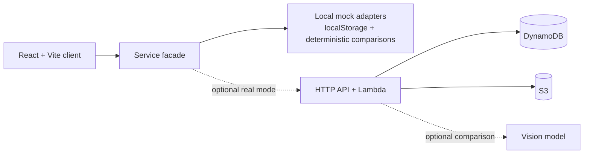

# AssetTrace: a shared, locked record of condition for every handover

**A mobile-first condition-recording workflow for fairer handovers.** AssetTrace helps two people capture an asset's starting condition, agree on the evidence, and compare it with the return state.

[Demo video](https://youtu.be/_fV54OxvKOc) · Built by Team Pandoras Box for First Commit (WeMakeDevs × AWS, Bharat Builds Tour)

> **Portfolio mode:** the application runs locally in a deterministic mock mode by default. Its former AWS deployment has been retired, so cloning this repository does not create or call cloud resources.

[Project write-up](https://builder.aws.com/content/3JauI08DzeMmEtFAvEJVmmkl8mO/ending-it-was-already-like-that-how-we-built-assettrace-on-aws)

## What it demonstrates

- A guided, two-party handover flow for vehicles, homes, surfaces, and custom assets.
- Browser-native evidence capture with camera, video, location, Web Crypto SHA-256 hashes, and capture timestamps.
- A server-enforced lifecycle: capture → acknowledge → lock → return → compare → report.
- A clean service boundary between local mock adapters and an optional AWS-backed implementation.
- A mobile-first React experience designed for real phone use, including permission, loading, empty, and recoverable-error states.

## Product flow

1. An **Owner** creates an inspection and records the baseline condition.
2. An **Owner** and **Renter** review and acknowledge the evidence.
3. The baseline becomes read-only once it is locked.
4. The return evidence is captured against the same inspection points.
5. A condition report presents the before/after record and comparison findings for human review.

The product intentionally treats automated comparisons as advisory evidence—not as a legal decision, proof of authenticity, or automatic damage assessment.

## Architecture


```mermaid
flowchart LR
    UI[React + Vite client] --> Service[Service facade]
    Service --> Mock[Local mock adapters\nlocalStorage + deterministic comparisons]
    Service -. optional real mode .-> API[HTTP API + Lambda]
    API --> Data[(DynamoDB)]
    API --> Media[(S3)]
    API -. optional comparison .-> Model[Vision model]
```

The mock and real adapters share the same application-facing contract. That makes the portfolio experience self-contained while preserving a clear path to reintroduce a backend later.

## Run locally

Requirements: Node.js 18+ and npm.

```bash
git clone https://github.com/utk1college/AssetTrace.git
cd AssetTrace
npm install
cp .env.example .env.local
npm run dev
```

Open the Vite URL and go to `/dashboard`. The supplied environment file sets `VITE_USE_MOCK=true`, so the app uses local storage and never contacts AWS.

```bash
npm run build
npm run lint
node --check backend/src/handler.mjs
```

## Optional backend configuration

The repository includes an AWS SAM backend reference for teams that want to restore a live integration. A real deployment requires you to deliberately supply your own Cognito IDs, evidence bucket, DynamoDB tables, frontend origin, API endpoint, and model access. No account-specific values are committed here.

```bash
cd backend
sam build
sam deploy --guided \
  --parameter-overrides \
    UserPoolId=<your-pool-id> \
    UserPoolClientId=<your-client-id> \
    EvidenceBucketName=<your-bucket> \
    AllowedOrigin=<your-frontend-origin>
```

For a live deployment, create the three tables referenced by the template (`AssetTrace-Inspections`, `AssetTrace-Evidence`, and `AssetTrace-Comparisons`) and put the returned API URL into `VITE_API_ENDPOINT`. Keep `VITE_USE_MOCK=true` unless those resources are intentionally configured.

## Technical highlights

| Area | Implementation |
|---|---|
| Frontend | React 19, TypeScript, Vite, Tailwind CSS, Zustand, React Router |
| Device APIs | Camera, MediaRecorder, Geolocation, device orientation, Web Crypto |
| Evidence integrity | SHA-256 hashes, capture metadata, phase-specific evidence, immutable lock/freeze states |
| Optional backend | Node.js Lambda, API Gateway HTTP API, Cognito, DynamoDB, S3, AWS SAM |
| Comparison contract | Structured statuses: `Existing`, `New`, `Uncertain`, and `No visible change` |

## Repository structure

```text
src/
├── components/   # Capture, evidence, comparison, report, and layout UI
├── pages/        # Route-level screens
├── services/     # Mock/real service adapters and the shared facade
├── store/        # Zustand application state
├── hooks/        # Browser integrations
└── utils/        # Hashing, location, telemetry, and session-code helpers
backend/
├── src/handler.mjs
├── template.yaml
└── s3-cors.json
```
